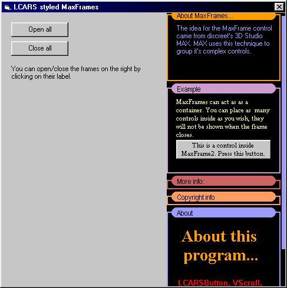



## MaxFrame Control

### Description

A Studio MAX-like(closeable) frame control with an LCARS style, with code to handle multiple frames. Check inside for more!
 
### More Info
 

             |
---                |---
**Submitted On**   |2003-09-11 20:39:50
**By**             |[Mihály Tallódi](https://github.com/Planet-Source-Code/PSCIndex/blob/master/ByAuthor/mih-ly-tall-di.md)
**Level**          |Intermediate
**User Rating**    |4.8 (19 globes from 4 users)
**Compatibility**  |VB 6\.0
**Category**       |[Custom Controls/ Forms/  Menus](https://github.com/Planet-Source-Code/PSCIndex/blob/master/ByCategory/custom-controls-forms-menus__1-4.md)
**World**          |[Visual Basic](https://github.com/Planet-Source-Code/PSCIndex/blob/master/ByWorld/visual-basic.md)
**Archive File**   |[MaxFrame\_C1644989132003\.zip](https://github.com/Planet-Source-Code/mih-ly-tall-di-maxframe-control__1-48465/archive/master.zip)

